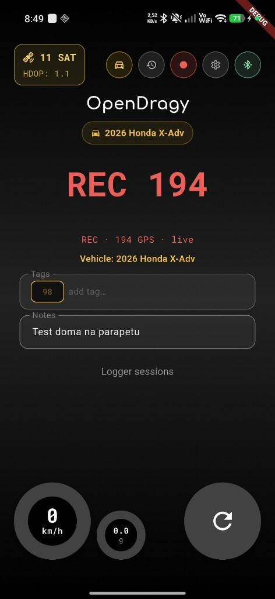

# 🏁 OpenDragy

OpenDragy is a high-precision, open-source vehicle performance timer that measures acceleration, speed intervals, and distances. It combines custom **ESP32-S3 firmware** reading a 10Hz GPS and a BMI160 accelerometer with a sleek, dark-themed **Flutter companion app** over Bluetooth Low Energy (BLE).

> [!TIP]
> **RaceChrono compatible.** The same firmware also speaks the official [RaceChrono DIY BLE GPS](https://github.com/aollin/racechrono-ble-diy-device) protocol (`0x1FF8`). Use OpenDragy *or* RaceChrono — one phone/app at a time. Setup: RaceChrono → Settings → **Add other device** → **RaceChrono DIY** → Bluetooth LE → select **`OpenDragy`**.

---

## ✨ Features

* **RaceChrono DIY GPS**: Dual BLE stack — Nordic UART for the OpenDragy app, plus RaceChrono DIY service `0x1FF8` (10 Hz GPS main + time). No app changes needed for RaceChrono.
* **High-Precision Telemetry (10Hz)**: Receives and parses raw NMEA sentences from the GPS module 10 times per second for precise speed and position data.
* **Sensor Fusion & Glitch Rejection**: Compares GPS speed increments with live accelerometer G-force data (running at 20Hz) from the IMU. Speed anomalies or multipath spikes that violate physical acceleration limits are automatically rejected.
* **Zero-Crossing Interpolation**: Interpolates the exact start time (down to the millisecond) between the last stationary tick and the first launch tick, guaranteeing highly accurate launch timings.
* **Auto-Armed Launch Control**: Automatically starts recording when speed exceeds `3.0 km/h` to bypass GPS drift/wandering, auto-stops when stationary, and auto-disarms upon completion.
* **Wakelock Integration**: Intelligently keeps your device screen awake and active during armed and ongoing runs, so you never miss your telemetry.
* **Pocket Mode**: Built primarily for motorcycle use — the phone screen may turn off while a foreground service keeps timing / logger alive with the phone in a pocket or tank bag.
* **BLE Auto-Connect**: Automatically scans for and reconnects to an advertising `OpenDragy` unit (remembers the last device). Manual disconnect pauses auto-connect until you open the device picker again.
* **A-GPS Cold-Start Aiding**: On BLE connect, injects phone UTC time and the last known coarse position into the u-blox M10 to speed up time-to-first-fix.
* **Continuous Logger Mode**: Records a full session to GPX + GPS/IMU CSV (with tags & notes) for offline PC analysis; sessions sync into a durable `/OpenDragy` folder on the phone. Share as a single `.odpkg` package for the PC analyzer.
* **Logger Tags**: Chip-style tag editor with suggestions from previous rides; filter and share sessions from the ride logs screen.
* **Live OSM Map**: Tap the yellow SAT chip on the dashboard to open an OpenStreetMap view of the current fix (coords, speed, altitude, HDOP).
* **Aesthetic Companion App**: Built with Flutter featuring a premium OLED black design with Neon Amber and Neon Green styling, utilizing the Inter font family.
* **Garage & Fleet Management**: Track multiple vehicles locally and link performance runs to specific cars or bikes.
* **Automated Weather Logging**: Uses coordinates from the GPS at the time of the run to fetch ambient temperature, altitude, and relative humidity from the free Open-Meteo API.
* **Run Database & Analytics**: View historical runs with detailed interactive charts showing speed curves, G-force mapping, and elevation/slope profiles to ensure valid runs.

---

## 📸 Screenshots



Still useful to add (portrait, into [`docs/screenshots/`](docs/screenshots/)):

| File | What to capture |
| :--- | :--- |
| `dashboard.png` | Main dashboard with BLE connected (speed, SAT chip, arm controls) |
| `map.png` | OSM map screen opened from the SAT chip (with a GPS fix) |
| `ride_logs.png` | Ride logs list with tags / share |
| `run_detail.png` | Post-run chart (speed + G-force) |
| `garage.png` | Garage / vehicle list |

---

## 🏎️ Supported Run Types & Targets

### Drag Mode (From a standstill)
* **Distances**: 60ft, 330ft, 1/8 mile, 1000 ft, 1/4 mile, 1/2 mile (includes trap speed calculations)
* **Speeds**: 0–60 mph, 0–100 km/h, 0–130 mph, 0–200 km/h
* **NHRA Mode**: Optional 1-ft rollout subtraction and 66ft average trap speed calculation to match official track times.

### Interval Mode (Speed-to-Speed)
* **Standard Ranges**:
  * **Imperial**: 0–60 mph, 0–100 mph, 50–75 mph, 60–100 mph, 60–130 mph, 0–130 mph
  * **Metric**: 0–100 km/h, 0–160 km/h, 80–120 km/h, 100–160 km/h, 100–200 km/h, 0–200 km/h
* **Custom Ranges**: Define your own starting and ending speeds (e.g., 100–150 km/h, 80–120 km/h) in both Metric and Imperial units.

---

## 🛠️ Hardware Setup

The hardware unit runs on an **ESP32-S3** microcontroller that interfaces with a high-speed GPS module and a 6-axis IMU sensor.

For a 3D-printable case for the OpenDragy hardware, check out the [OpenDragy Printables page](https://www.printables.com/model/1762658-opendragy-open-source-high-precision-10hz-gps-perf).

### 📋 Bill of Materials (BOM)
1. **ESP32-S3 Mini Development Board** (or similar ESP32-S3 board)
2. **QUESCAN G10A-F30 UBX M10 GPS Module** (supporting 10-25Hz refresh rates and configured at 115200 baud)
3. **BMI160 Accelerometer/Gyroscope IMU Module** (connected via I2C)

### 🔌 Pin Connections
Connect the components to your ESP32-S3 board using the following pin mapping defined in the firmware:

| Component | Component Pin | ESP32-S3 Pin | Notes |
| :--- | :--- | :--- | :--- |
| **BMI160 IMU** | VCC | 3.3V | Power supply |
| | GND | GND | Ground |
| | SDA | **GPIO 1** | I2C Data line |
| | SCL | **GPIO 2** | I2C Clock line |
| **u-blox GPS** | VCC | 3.3V or 5V | Power supply (depending on module) |
| | GND | GND | Ground |
| | TX | **GPIO 4** | Connects to ESP32-S3 RX (UART1) |
| | RX | **GPIO 5** | Connects to ESP32-S3 TX (UART1) |

---

## 💾 Firmware Installation

The ESP32-S3 firmware is located in [OpenDragy.ino](file:///d:/Projets/open-dragy/OpenDragy.ino).

1. Install the Arduino IDE or VS Code with the PlatformIO extension.
2. Install the **ESP32 board support package** if using Arduino IDE.
3. Install the library dependencies:
   * **DFRobot_BMI160** library (for interfacing with the IMU)
   * **BLE** stack (built-in for ESP32/ESP32-S3)
4. Open [OpenDragy.ino](file:///d:/Projets/open-dragy/OpenDragy.ino).
5. Compile and flash the code to your ESP32-S3.
6. The device will boot and start broadcasting a BLE service named `OpenDragy`.

### RaceChrono (DIY BLE GPS)

The firmware advertises **two** BLE services at once:

| Client | Service | What you get |
| :--- | :--- | :--- |
| **OpenDragy app** | Nordic UART (`6e400001-…`) | NMEA + IMU (unchanged) |
| **RaceChrono** | DIY GPS (`0x1FF8`) | 10 Hz binary GPS (lat/lon/speed/bearing/HDOP) |

In RaceChrono:

1. Settings (gear) → **Add other device** → **RaceChrono DIY**
2. Choose **GPS**, connection **Bluetooth LE**
3. Select **`OpenDragy`**

Disconnect the OpenDragy app first (ESP32 Arduino BLE is one client at a time). Do **not** use RaceChrono’s classic “Bluetooth GPS” SPP list — that is for Classic BT mice, not this device.

> [!IMPORTANT]
> Your u-blox M10 GPS module must be configured before first use to ensure it outputs GGA/RMC messages at 10Hz at 115200 baud. Follow the step-by-step guide in [README_GPS_CONFIG.md](file:///d:/Projets/open-dragy/README_GPS_CONFIG.md) using the **u-center 2** utility.

---

## 📱 Mobile App Setup

The companion application is written in Flutter and is located in the root directory.

### Prerequisites
* Flutter SDK (v3.11.5 or newer recommended)
* Android Studio (for Android build) / Xcode (for iOS build, macOS required)
* A physical device with Bluetooth enabled (BLE is not supported on most simulators/emulators)

### Getting Started

1. Get packages and dependencies:
   ```bash
   flutter pub get
   ```

2. Run the application on a connected device:
   ```bash
   flutter run --release
   ```
   *(Running in release mode is recommended for accurate performance and UI timing).*

---

## 🚀 Releasing (Android APK)

GitHub Actions builds a **release** APK (no debug suffix / no DEBUG ribbon) and attaches it to a [GitHub Release](https://github.com/stewe12/open-dragy/releases).

### One-time: signing secrets

Create an upload keystore locally (keep the `.jks` out of git — already gitignored):

```bash
keytool -genkey -v -keystore upload-keystore.jks -keyalg RSA -keysize 2048 -validity 10000 -alias upload
```

Encode the keystore (Linux/macOS / Git Bash):

```bash
base64 -w0 upload-keystore.jks
```

PowerShell:

```powershell
[Convert]::ToBase64String([IO.File]::ReadAllBytes("upload-keystore.jks"))
```

In the GitHub repo go to **Settings → Secrets and variables → Actions** and add:

| Secret | Value |
| :--- | :--- |
| `ANDROID_KEYSTORE_BASE64` | Base64 of `upload-keystore.jks` |
| `ANDROID_KEY_ALIAS` | Key alias (e.g. `upload`) |
| `ANDROID_KEY_PASSWORD` | Key password |
| `ANDROID_STORE_PASSWORD` | Keystore password |

Without these secrets the Android release job **fails** (no debug-signed APK on Releases).

### Publish a release

1. Bump `version:` in [`pubspec.yaml`](pubspec.yaml) (e.g. `1.0.7+39`).
2. Commit and push to `main`.
3. Tag and push:
   ```bash
   git tag v1.0.7
   git push origin v1.0.7
   ```
4. Wait for the **Build Mobile Apps** workflow, then download `OpenDragy_v1.0.7.apk` from **Releases**.

You can also run the workflow manually (**Actions → Build Mobile Apps → Run workflow**); it creates/updates a release tagged `v{version}` from `pubspec.yaml`.

---

## 📂 Code Structure

* [OpenDragy.ino](file:///d:/Projets/open-dragy/OpenDragy.ino): Microcontroller C++ firmware for reading UART GPS data & I2C IMU data and transmitting over BLE.
* [lib/main.dart](file:///d:/Projets/open-dragy/lib/main.dart): Main application entry point, sets up global theme and screen routing.
* [lib/services/physics_engine.dart](file:///d:/Projets/open-dragy/lib/services/physics_engine.dart): Advanced physics computations (trapezoidal integration, sensor fusion filters, interpolation logic).
* [lib/services/ble_service.dart](file:///d:/Projets/open-dragy/lib/services/ble_service.dart): BLE scanner and stream listener for UART & IMU data.
* [lib/providers/dragy_provider.dart](file:///d:/Projets/open-dragy/lib/providers/dragy_provider.dart): Core state provider coordinating Bluetooth events, GPS/IMU data processing, runs logic, settings, and database saves.
* [lib/services/history_service.dart](file:///d:/Projets/open-dragy/lib/services/history_service.dart): Manages local saving and retrieval of historical run logs.
* [lib/services/weather_service.dart](file:///d:/Projets/open-dragy/lib/services/weather_service.dart): Integration with Open-Meteo API to log run-time environment data.
* [lib/services/garage_service.dart](file:///d:/Projets/open-dragy/lib/services/garage_service.dart): Manages local storage of vehicle profiles (cars, bikes) for fleet management.
* [lib/services/settings_service.dart](file:///d:/Projets/open-dragy/lib/services/settings_service.dart): Handles user preferences such as unit toggles (Metric/Imperial) and app settings.
* [lib/screens/dashboard_screen.dart](file:///d:/Projets/open-dragy/lib/screens/dashboard_screen.dart): Live telemetry display, speedometer, Bluetooth controls, and active timer stats.
* [lib/screens/run_history_screen.dart](file:///d:/Projets/open-dragy/lib/screens/run_history_screen.dart): Displays the history of all recorded runs and allows filtering or selecting runs to view details.
* [lib/screens/run_detail_screen.dart](file:///d:/Projets/open-dragy/lib/screens/run_detail_screen.dart): Post-run analysis, graphs, G-force curves, and slope validations.
* [lib/screens/garage_screen.dart](file:///d:/Projets/open-dragy/lib/screens/garage_screen.dart): Interface for adding, editing, and selecting vehicles.
* [lib/screens/settings_screen.dart](file:///d:/Projets/open-dragy/lib/screens/settings_screen.dart): UI for configuring app preferences.
* [lib/screens/satellite_status_screen.dart](lib/screens/satellite_status_screen.dart): Live OSM map + GPS fix stats (opened from the SAT chip).
* [lib/screens/ride_logs_screen.dart](lib/screens/ride_logs_screen.dart): Logger sessions browser (tags, share GPX/CSV).
* [lib/services/open_dragy_storage.dart](lib/services/open_dragy_storage.dart): Durable `/OpenDragy` folder sync for settings, garage, runs, and logger sessions.
* [lib/utils/ubx_mga.dart](lib/utils/ubx_mga.dart): UBX-MGA time/position aiding frames for faster M10 cold starts.
