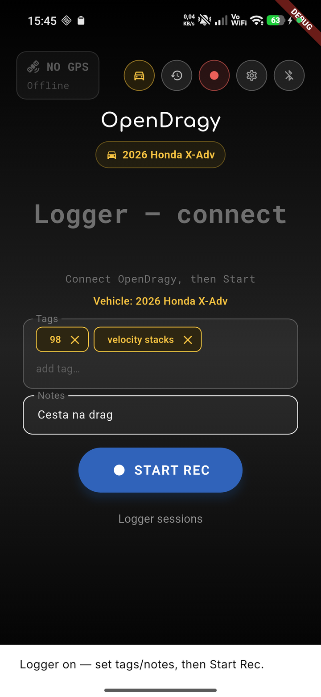
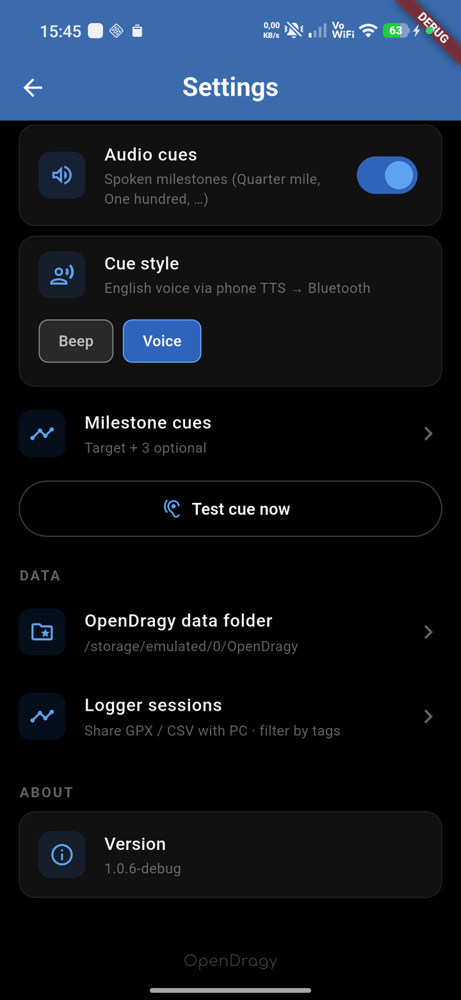
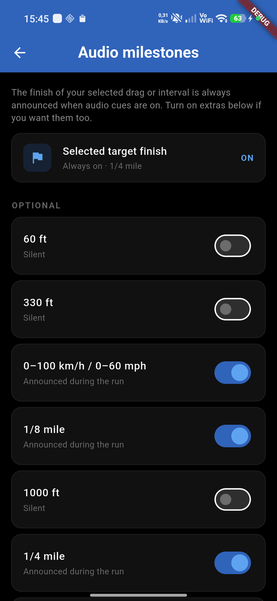
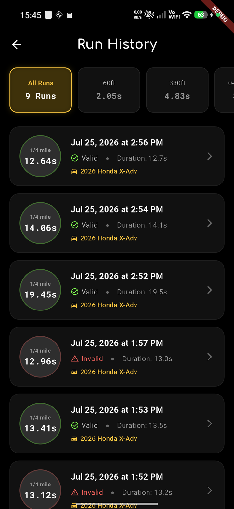
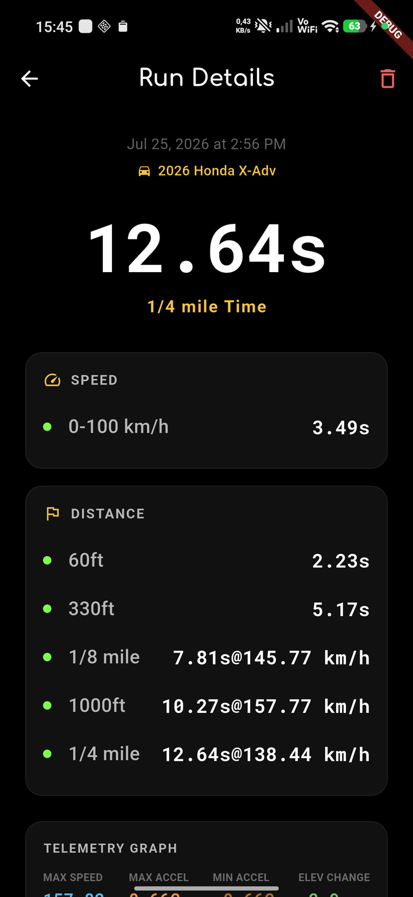
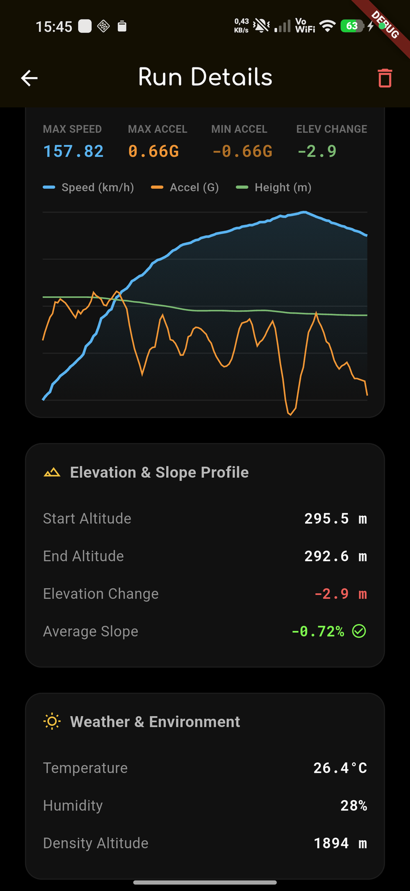
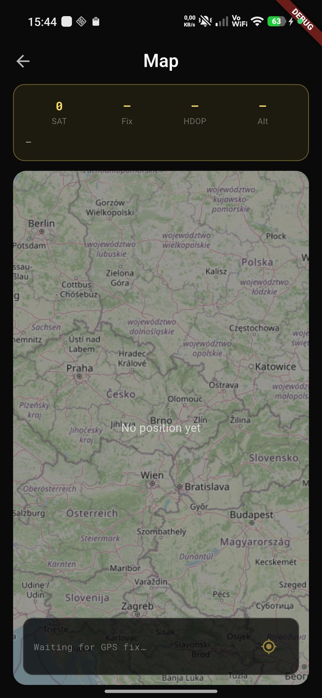

# 🏁 OpenDragy

OpenDragy is a high-precision, open-source vehicle performance timer that measures acceleration, speed intervals, and distances. It combines custom **ESP32-S3 firmware** reading a **10 Hz UBX-NAV-PVT** GPS stream (Dragy-class `gSpeed` + `hAcc`) and a BMI160 accelerometer with a sleek, dark-themed **Flutter companion app** over Bluetooth Low Energy (BLE).

---

## ✨ Features

* **UBX-NAV-PVT telemetry (10 Hz)**: Firmware parses u-blox NAV-PVT and sends a compact **ODGP** binary fix over Nordic UART — ground speed + horizontal accuracy (`hAcc`) for Dragy-class timing and GPS-ready gating.
* **Multi-GNSS + SBAS (Europe)**: Boot config enables GPS / Galileo / GLONASS and SBAS (EGNOS) with Automotive dynamic model. BeiDou is requested when the module accepts those CFG keys (some M10 builds NAK them).
* **Sensor Fusion & Glitch Rejection**: Compares GPS speed increments with live accelerometer G-force data (running at 20Hz) from the IMU. Speed anomalies or multipath spikes that violate physical acceleration limits are automatically rejected.
* **Zero-Crossing Interpolation**: Interpolates the exact start time (down to the millisecond) between the last stationary tick and the first launch tick, guaranteeing highly accurate launch timings.
* **Auto-Armed Launch Control**: Automatically starts recording when speed exceeds `3.0 km/h` to bypass GPS drift/wandering, auto-stops when stationary, and auto-disarms upon completion.
* **Helmet Audio Cues**: Optional beeps or spoken English milestones through Bluetooth / intercom (navigation-style audio routing). The selected drag or interval finish is always announced; extras (60 ft, 0–100 km/h, ⅛ mile, …) are toggled in **Settings → Milestone cues**. Distinct beep patterns: 1 short / 2 short / long+2 short for finish.
* **Finish Celebration**: Optional full-screen flash or checkered-flag overlay when the selected target completes (only while the display is on).
* **ARM IMU Zero**: After you tap **ARM**, ~0.5 s of IMU samples set the longitudinal G baseline so a lightly tilted mount reads ~0 G at rest.
* **Raw Drag Logs**: Every valid timed run saves metrics JSON plus raw GPS/IMU CSV under `/OpenDragy/runs/{id}/` for PC analysis (NHRA / non-NHRA, charts, re-scoring later).
* **Wakelock Integration**: Intelligently keeps your device screen awake and active during armed and ongoing runs, so you never miss your telemetry.
* **Pocket Mode**: Built primarily for motorcycle use — the phone screen may turn off while a quiet foreground service keeps timing / logger alive with the phone in a pocket or tank bag.
* **BLE Auto-Connect**: Automatically scans and reconnects to an advertising `OpenDragy` unit (remembers the last device; faster retries while the app is in the foreground). Manual disconnect pauses auto-connect until you open the device picker again.
* **A-GPS Cold-Start Aiding**: On BLE connect, injects trusted phone UTC (~1 s) plus the phone’s current location (fallback: last OpenDragy fix) into the u-blox M10 to speed up time-to-first-fix.
* **Continuous Logger Mode**: Separate from ARM timing — set tags/notes first, then **Start Rec** / **Stop Rec**. Writes GPX + GPS/IMU CSV into `/OpenDragy/rides/`; share as a single `.odpkg` for the PC analyzer. Leaving logger mode stops recording.
* **Logger Tags**: Chip-style tag editor with suggestions from previous rides; filter and share sessions from the ride logs screen.
* **Live OSM Map**: Tap the yellow SAT chip on the dashboard to open an OpenStreetMap view of the current fix (coords, speed, altitude, `hAcc`).
* **Aesthetic Companion App**: Built with Flutter featuring a premium OLED black design with Neon Amber and Neon Green styling (Roboto / Roboto Mono via Google Fonts).
* **Garage & Fleet Management**: Track multiple vehicles locally and link performance runs to specific cars or bikes.
* **Automated Weather Logging**: Uses coordinates from the GPS at the time of the run to fetch ambient temperature, altitude, and relative humidity from the free Open-Meteo API.
* **Run Database & Analytics**: View historical runs with detailed interactive charts showing speed curves, G-force mapping, and elevation/slope profiles to ensure valid runs.

---

## 🎧 Riding tips (motorcycle)

1. Pair the phone to your helmet intercom (media / music audio, not only phone calls).
2. **Settings → Audio cues** on → pick **Beep** or **Voice** → **Test cue now** before you leave.
3. **Milestone cues**: finish of the selected target is always on; enable 0–100 / ⅛ / etc. if you want mid-run callouts.
4. Tap **ARM** while staged — wait ~0.5 s for IMU zero, then launch.
5. After a clean pull, check run detail for `Raw log · … GPS · … IMU`, or pull files from:

```text
/OpenDragy/runs/{runId}.json      # metrics + embedded raw block
/OpenDragy/runs/{runId}/gps.csv   # raw GPS
/OpenDragy/runs/{runId}/imu.csv   # raw IMU (g)
```

---

## 📸 Screenshots

| Dashboard | Logger (manual Start Rec) | Audio cues |
| :---: | :---: | :---: |
|  |  |  |

| Milestone cues | Run history | Run detail |
| :---: | :---: | :---: |
|  |  |  |

| Telemetry chart | Garage | Map |
| :---: | :---: | :---: |
|  |  |  |

---

## 🏎️ Supported Run Types & Targets

### Drag Mode (From a standstill)
* **Distances**: 60ft, 330ft, 1/8 mile, 1000 ft, 1/4 mile, 1/2 mile (includes trap speed calculations)
* **Speeds**: 0–60 mph, 0–100 km/h, 0–130 mph, 0–200 km/h
* **NHRA Mode**: Optional 1-ft rollout subtraction and 66ft average trap speed calculation to match official track times.

### Interval Mode (Speed-to-Speed)
* **Standard Ranges**:
  * **Imperial**: 0–60 mph, 0–100 mph, 50–75 mph, 60–100 mph, 60–130 mph, 0–130 mph
  * **Metric**: 0–100 km/h, 0–160 km/h, 80–120 km/h, 100–160 km/h, 100–200 km/h, 0–200 km/h
* **Custom Ranges**: Define your own starting and ending speeds (e.g., 100–150 km/h, 80–120 km/h) in both Metric and Imperial units.

---

## 🛠️ Hardware Setup

The hardware unit runs on an **ESP32-S3** microcontroller that interfaces with a high-speed GPS module and a 6-axis IMU sensor.

For a 3D-printable case for the OpenDragy hardware, check out the [OpenDragy Printables page](https://www.printables.com/model/1762658-opendragy-open-source-high-precision-10hz-gps-perf).

### 📋 Bill of Materials (BOM)
1. **ESP32-S3 Mini Development Board** (or similar ESP32-S3 board)
2. **u-blox M10 GPS** (e.g. **MicoAir MG-A01** or QUESCAN G10A-F30) @ **115200** baud — firmware auto-configures NAV-PVT @ 10 Hz
3. **BMI160 Accelerometer/Gyroscope IMU Module** (connected via I2C)

### 🔌 Pin Connections
Connect the components to your ESP32-S3 board using the following pin mapping defined in the firmware:

| Component | Component Pin | ESP32-S3 Pin | Notes |
| :--- | :--- | :--- | :--- |
| **BMI160 IMU** | VCC | 3.3V | Power supply |
| | GND | GND | Ground |
| | SDA | **GPIO 1** | I2C Data line |
| | SCL | **GPIO 2** | I2C Clock line |
| **u-blox GPS** | VCC | 3.3V or 5V | Power supply (depending on module) |
| | GND | GND | Ground |
| | TX | **GPIO 4** | Connects to ESP32-S3 RX (UART1) |
| | RX | **GPIO 5** | Connects to ESP32-S3 TX (UART1) |

---

## 💾 Firmware Installation

The ESP32-S3 firmware is [`OpenDragy.ino`](OpenDragy.ino) in the repo root. Keep [`serial_to_serial/SerialToSerial.ino`](serial_to_serial/SerialToSerial.ino) out of that folder when compiling — Arduino merges every `.ino` in the same directory.

1. Install the Arduino IDE or VS Code with the PlatformIO extension.
2. Install the **ESP32 board support package** if using Arduino IDE.
3. Install the library dependencies:
   * **DFRobot_BMI160** library (for interfacing with the IMU)
   * **BLE** stack (built-in for ESP32/ESP32-S3)
4. Open [`OpenDragy.ino`](OpenDragy.ino) alone (or a copy in its own sketch folder).
5. Compile and flash the code to your ESP32-S3 (e.g. Waveshare ESP32-S3-Zero).
6. The device will boot and start broadcasting a BLE service named `OpenDragy` (Nordic UART: **ODGP** GPS + IMU).

> [!TIP]
> On boot the firmware configures the M10 for **UBX-NAV-PVT @ 10 Hz** (NMEA output dropped once PVT is live). Optional manual check with u-center / passthrough: see [README_GPS_CONFIG.md](README_GPS_CONFIG.md).

---

## 📱 Mobile App Setup

The companion application is written in Flutter and is located in the root directory.

### Prerequisites
* Flutter SDK (v3.11.5 or newer recommended)
* Android Studio (for Android build) / Xcode (for iOS build, macOS required)
* A physical device with Bluetooth enabled (BLE is not supported on most simulators/emulators)

### Getting Started

1. Get packages and dependencies:
   ```bash
   flutter pub get
   ```

2. Run the application on a connected device:
   ```bash
   flutter run --release
   ```
   *(Running in release mode is recommended for accurate performance and UI timing).*

---

## 🚀 Releasing (Android APK)

GitHub Actions builds a **release** APK (no debug suffix / no DEBUG ribbon) and attaches it to a [GitHub Release](https://github.com/stewe12/open-dragy/releases).

### One-time: signing secrets

Create an upload keystore locally (keep the `.jks` out of git — already gitignored):

```bash
keytool -genkey -v -keystore upload-keystore.jks -keyalg RSA -keysize 2048 -validity 10000 -alias upload
```

Encode the keystore (Linux/macOS / Git Bash):

```bash
base64 -w0 upload-keystore.jks
```

PowerShell:

```powershell
[Convert]::ToBase64String([IO.File]::ReadAllBytes("upload-keystore.jks"))
```

In the GitHub repo go to **Settings → Secrets and variables → Actions** and add:

| Secret | Value |
| :--- | :--- |
| `ANDROID_KEYSTORE_BASE64` | Base64 of `upload-keystore.jks` |
| `ANDROID_KEY_ALIAS` | Key alias (e.g. `upload`) |
| `ANDROID_KEY_PASSWORD` | Key password |
| `ANDROID_STORE_PASSWORD` | Keystore password |

Without these secrets the Android release job **fails** (no debug-signed APK on Releases).

### Publish a release

1. Bump `version:` in [`pubspec.yaml`](pubspec.yaml) (e.g. `1.0.9+43`).
2. Commit and push to `main`.
3. Tag and push:
   ```bash
   git tag v1.0.9
   git push origin v1.0.9
   ```
4. Wait for the **Build Mobile Apps** workflow, then download `OpenDragy_v1.0.9.apk` from **Releases**.

You can also run the workflow manually (**Actions → Build Mobile Apps → Run workflow**); it creates/updates a release tagged `v{version}` from `pubspec.yaml`.

---

## 📂 Code Structure

* [`OpenDragy.ino`](OpenDragy.ino): ESP32-S3 firmware — UBX-NAV-PVT parse, ODGP + IMU over BLE NUS, boot CFG for M10.
* [`serial_to_serial/SerialToSerial.ino`](serial_to_serial/SerialToSerial.ino): USB↔GPS UART bridge for u-center (separate sketch).
* [`tools/configure_gps_pvt.py`](tools/configure_gps_pvt.py): Optional PC-side UBX CFG over the SerialToSerial bridge.
* [`lib/main.dart`](lib/main.dart): App entry, theme, routing.
* [`lib/services/physics_engine.dart`](lib/services/physics_engine.dart): Trapezoidal integration, sensor fusion, interpolation.
* [`lib/services/ble_service.dart`](lib/services/ble_service.dart): BLE scanner; ODGP + legacy NMEA + IMU streams.
* [`lib/utils/odgp_parser.dart`](lib/utils/odgp_parser.dart): Binary ODGP v1 packet parser (NAV-PVT fields).
* [`lib/providers/dragy_provider.dart`](lib/providers/dragy_provider.dart): Core state — BLE, timing, aiding, logger, settings, persistence.
* [`lib/services/history_service.dart`](lib/services/history_service.dart): Local run history storage.
* [`lib/services/weather_service.dart`](lib/services/weather_service.dart): Open-Meteo ambient conditions at run time.
* [`lib/services/garage_service.dart`](lib/services/garage_service.dart): Vehicle profiles.
* [`lib/services/settings_service.dart`](lib/services/settings_service.dart): User preferences (units, cues, NHRA, …).
* [`lib/screens/dashboard_screen.dart`](lib/screens/dashboard_screen.dart): Live telemetry, ARM, logger controls.
* [`lib/screens/run_history_screen.dart`](lib/screens/run_history_screen.dart): Run list / filters.
* [`lib/screens/run_detail_screen.dart`](lib/screens/run_detail_screen.dart): Post-run charts and validation.
* [`lib/screens/garage_screen.dart`](lib/screens/garage_screen.dart): Vehicle editor / picker.
* [`lib/screens/settings_screen.dart`](lib/screens/settings_screen.dart): App preferences UI.
* [`lib/screens/audio_milestones_screen.dart`](lib/screens/audio_milestones_screen.dart): Optional mid-run audio milestones.
* [`lib/screens/satellite_status_screen.dart`](lib/screens/satellite_status_screen.dart): OSM map + `hAcc` / fix stats (from SAT chip).
* [`lib/screens/ride_logs_screen.dart`](lib/screens/ride_logs_screen.dart): Logger sessions browser.
* [`lib/services/milestone_audio_service.dart`](lib/services/milestone_audio_service.dart): Helmet beeps / TTS.
* [`lib/services/open_dragy_storage.dart`](lib/services/open_dragy_storage.dart): Durable `/OpenDragy` folder sync.
* [`lib/models/raw_run_log.dart`](lib/models/raw_run_log.dart): In-run GPS/IMU capture for valid runs.
* [`lib/widgets/finish_celebration_overlay.dart`](lib/widgets/finish_celebration_overlay.dart): Finish flash / checkered overlay.
* [`lib/utils/ubx_mga.dart`](lib/utils/ubx_mga.dart): UBX-MGA-INI time/position aiding builders.
* [`OpenDragy_technical_spec.md`](OpenDragy_technical_spec.md): Planning notes (partially historical — see banner in that file).
* [`analyzer/`](analyzer/): Desktop Streamlit tool for logger `.odpkg` sessions (pull detection, A/B, map, MoTeC export).
